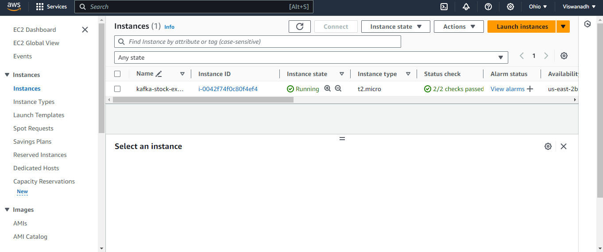
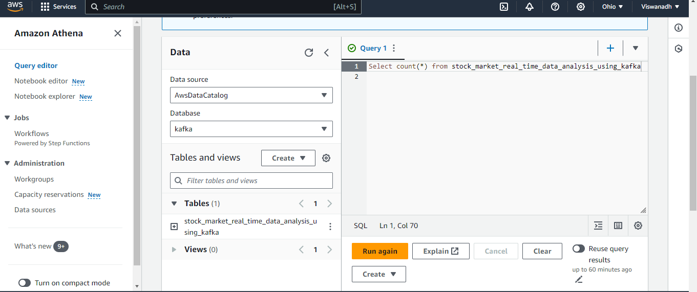

# Stock Market Kafka Data Engineering Project

In this project, I spearheaded a comprehensive data engineering solution for stock market data, employing cutting-edge technologies to ensure efficiency and scalability.

## Technologies Used
- **Python:** Core programming language for project development.
- **Apache Kafka:** Distributed streaming platform for real-time data processing.
- **AWS EC2:** Utilized as a virtual machine to run the Kafka infrastructure.
- **AWS S3:** Robust storage solution for Kafka topics, enabling seamless data management.
- **AWS Glue:** Integrated for Extract, Transform, Load (ETL) operations, ensuring data integrity.
- **AWS Athena:** Used for querying data, providing valuable insights for decision-making.

## Project Highlights
- **Storage Infrastructure:** AWS S3 forms the backbone for storing Kafka topics, optimizing data accessibility.
- **Data Crawling:** Implemented a custom crawler over S3 for efficient navigation through data objects.
- **ETL Operations:** AWS Glue is leveraged for streamlined ETL operations, ensuring consistent and reliable data processing.
- **Querying Insights:** AWS Athena facilitates easy and efficient querying, empowering data-driven decision-making.

This project seamlessly integrates advanced technologies to navigate the dynamic stock market landscape, providing actionable insights for informed decision-making.
#s3

#EC2

#Athena

